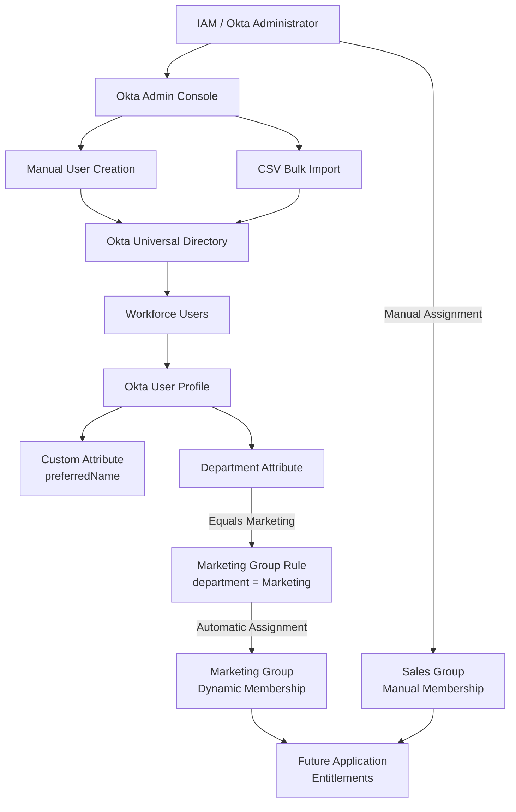
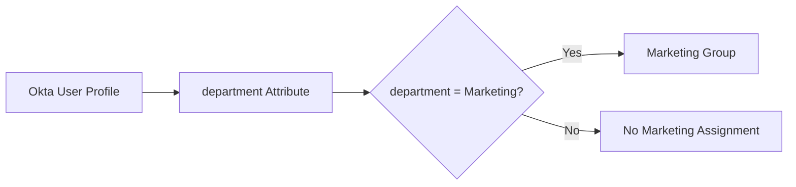

# Okta Identity Lifecycle & Group Management Lab

> **Hands-on Identity & Access Management (IAM) lab demonstrating user
> provisioning, profile schema customization, bulk CSV imports,
> department-driven group rules, dynamic group membership, and manual
> group administration in Okta.**

## Project Overview

This project demonstrates core **Okta Universal Directory**
administration and identity lifecycle concepts in an Okta tenant.

The lab covers multiple ways identities and access structures can be
managed:

-   Creating a user manually through the Okta Admin Console
-   Activating and validating a new user
-   Extending the Okta user profile with a custom attribute
-   Updating a user's custom profile data
-   Bulk importing users from CSV
-   Creating departmental groups
-   Automatically assigning users to a group using an attribute-based
    group rule
-   Manually assigning users to a group
-   Validating user and group membership

The project models foundational tasks performed by IAM administrators
and engineers when managing workforce identities at scale.

------------------------------------------------------------------------

## Business Scenario

An organization is onboarding employees into Okta and needs a repeatable
way to create identities, maintain user attributes, and place employees
into the appropriate access groups.

The IAM team must support both individual onboarding and bulk
onboarding. The organization also wants to reduce manual administration
by using authoritative profile attributes such as `department` to
automatically determine group membership.

For this lab:

``` text
User Profile
     ↓
Department Attribute
     ↓
Okta Group Rule
     ↓
Marketing Group
```

A separate **Sales** group demonstrates manual membership assignment.

This allows the project to compare **automated attribute-driven group
management** with **manual group administration**.

------------------------------------------------------------------------

# Architecture Diagram



------------------------------------------------------------------------

## Identity Lifecycle Flow

``` text
Identity Creation
      ↓
Profile Population
      ↓
Account Activation
      ↓
Attribute Management
      ↓
Group Evaluation
      ↓
Group Membership
      ↓
Application / Resource Entitlement
```

This lab primarily focuses on the **identity creation, profile, and
group-management layers** of that lifecycle.

------------------------------------------------------------------------

# IAM Concepts Demonstrated

  -----------------------------------------------------------------------
  IAM Concept                         Lab Implementation
  ----------------------------------- -----------------------------------
  Identity Provisioning               Manual Okta user creation

  Bulk Provisioning                   CSV user import

  Universal Directory                 Central Okta user profiles

  Identity Attributes                 First name, last name, email,
                                      department

  Schema Extension                    Custom `preferredName` attribute

  Account Activation                  User activation and login
                                      validation

  Dynamic Group Membership            Department-based Okta group rule

  Attribute-Based Logic               `department = Marketing`

  Manual Administration               Manual Sales group assignment

  Authorization Foundation            Groups prepared for downstream
                                      application assignment

  Identity Validation                 People and Groups pages used to
                                      confirm results
  -----------------------------------------------------------------------

------------------------------------------------------------------------

# Technologies Used

-   Okta Workforce Identity
-   Okta Universal Directory
-   Okta Admin Console
-   Okta Profile Editor
-   Okta Groups
-   Okta Group Rules
-   CSV
-   Attribute-Based Identity Management
-   Web Browser

------------------------------------------------------------------------

# Lab Objectives

The objectives of this lab are to:

1.  Provision an individual user through the Okta Admin Console.
2.  Validate successful account creation and user login.
3.  Extend the Okta user schema with a custom attribute.
4.  Populate the custom attribute on an existing identity.
5.  Import multiple workforce identities using CSV.
6.  Create departmental groups.
7.  Automatically place Marketing users into a group using the
    `department` attribute.
8.  Create a Sales group and manually assign users.
9.  Validate both automated and manual membership.

------------------------------------------------------------------------

# Implementation

## Phase 1 --- Provision a User Through the Okta Admin Console

Sign in with the required administrative privileges.

Navigate to:

``` text
Directory
→ People
→ Add Person
```

Populate the user profile fields used by the lab:

``` text
First Name
Last Name
Username
Primary Email
```

Configure the activation settings according to the lab requirements and
save the identity.

### Validation

Return to:

``` text
Directory
→ People
```

Confirm that the newly created user appears on the People page.

Then validate that the user can successfully sign in.

### IAM Significance

This represents **manual identity provisioning**.

Manual provisioning is useful for:

-   Testing
-   Small environments
-   Administrative accounts
-   Exception handling
-   Troubleshooting

At enterprise scale, identity creation is typically automated from an
authoritative source such as an HR system or directory.

------------------------------------------------------------------------

# Phase 2 --- Extend the Okta User Profile

The lab adds a custom profile attribute called:

``` text
Preferred Name
```

Navigate to:

``` text
Directory
→ Profile Editor
→ Okta User
```

Select:

``` text
Add Attribute
```

Configure:

  Setting                Value
  ---------------------- ------------------
  Data Type              String
  Display Name           `Preferred Name`
  Variable Name          `preferredName`
  Attribute Permission   Read-Write

Save the new attribute.

### Validation

Confirm that **Preferred Name** appears in the Okta user profile schema
as a custom attribute.

------------------------------------------------------------------------

## Why Custom Attributes Matter

Identity systems frequently need business data that is not included in a
platform's default schema.

Examples include:

``` text
employeeType
costCenter
businessUnit
preferredName
locationCode
employmentStatus
```

These attributes can later support:

-   Group rules
-   Application assignments
-   Profile mappings
-   Provisioning
-   Access policies
-   Governance decisions

This makes profile schema design an important part of enterprise IAM
engineering.

------------------------------------------------------------------------

# Phase 3 --- Populate the Custom Attribute

Navigate to:

``` text
Directory
→ People
→ Tom Ford
→ Profile
→ Edit
```

Populate:

``` text
Preferred Name: Tom
```

Save the profile.

### Validation

Confirm that the `preferredName` attribute now contains the expected
value.

The flow is:

``` text
Okta User
   ↓
Universal Directory Profile
   ↓
preferredName = Tom
```

------------------------------------------------------------------------

# Phase 4 --- Bulk Import Users with CSV

Manual identity creation does not scale efficiently for large onboarding
events.

The lab therefore demonstrates **bulk provisioning through CSV**.

Navigate to:

``` text
Directory
→ People
→ More Actions
→ Import Users from CSV
```

Download the Okta CSV template.

Populate the fields used by the lab:

``` text
login
firstName
lastName
email
department
```

The lab CSV includes users across **Sales** and **Marketing**
departments.

### Import Process

Select:

``` text
Browse
→ Select CSV
→ Upload CSV
```

Confirm that Okta successfully parses and validates the file.

Select:

``` text
Next
```

The lab then enables automatic activation of the imported users and
starts the import.

After the import completes, select:

``` text
Done
```

### Validation

Confirm that the new identities appear under:

``` text
Directory
→ People
```

The lab evidence shows four users imported successfully.

------------------------------------------------------------------------

# Phase 5 --- Validate Imported Accounts

Review the imported identities on the People page.

The lab imports:

  User           Department
  -------------- ------------
  Anna Ford      Sales
  David Smith    Sales
  James Lee      Marketing
  Solomon Page   Marketing

The source lab then validates/activates the accounts through user login.

### Identity Data Flow

``` text
CSV
 ↓
Okta Import Validation
 ↓
Universal Directory
 ↓
User Profiles
 ↓
Department Attribute
```

The `department` value becomes particularly important in the next phase
because it drives automated group membership.

------------------------------------------------------------------------

# Phase 6 --- Create the Marketing Group

Navigate to:

``` text
Directory
→ Groups
→ Add Group
```

Create:

``` text
Name: Marketing
Description: All Marketing
```

Save the group.

At this point, the group exists but automation still needs to determine
which identities belong to it.

------------------------------------------------------------------------

# Phase 7 --- Automate Marketing Membership with a Group Rule

Navigate to:

``` text
Directory
→ Groups
→ Rules
→ Add Rule
```

Create a rule named:

``` text
Marketing Rule
```

Configure the condition demonstrated in the lab:

``` text
IF
User attribute: department
Operator: Equals
Value: Marketing

THEN
Assign to: Marketing
```

Save the rule.

Activate it through:

``` text
Actions
→ Activate
```

------------------------------------------------------------------------

## Dynamic Membership Architecture



### IAM Significance

This converts group membership from a manual administrative decision
into **attribute-driven automation**.

Instead of:

``` text
Administrator
→ Find User
→ Open Group
→ Assign User
```

the identity platform evaluates:

``` text
department = Marketing
        ↓
Marketing Rule
        ↓
Marketing Group
```

This is an important foundation for scalable IAM because downstream
access can later be attached to the group.

------------------------------------------------------------------------

# Phase 8 --- Validate Automated Marketing Membership

Open the Marketing group and review its members.

The completed lab shows:

``` text
James Lee   → Managed by Marketing Rule
Solomon Page → Managed by Marketing Rule
```

This confirms that the rule evaluated the `department` attribute and
dynamically assigned the matching users.

### Automated Entitlement Pattern

The design can later be extended to:

``` text
HR Source
   ↓
Department = Marketing
   ↓
Okta User Profile
   ↓
Marketing Rule
   ↓
Marketing Group
   ↓
Dropbox / Salesforce / Marketing Apps
```

This is a common enterprise identity automation pattern.

------------------------------------------------------------------------

# Phase 9 --- Create the Sales Group

Navigate to:

``` text
Directory
→ Groups
→ Add Group
```

Create:

``` text
Name: Sales
Description: All Sales
```

Save the group and confirm that it appears in the Okta group directory.

------------------------------------------------------------------------

# Phase 10 --- Assign Sales Users Manually

Open:

``` text
Directory
→ Groups
→ Sales
→ People
→ Assign People
```

Select the required Sales identities.

The completed lab assigns:

``` text
Anna Ford
David Smith
```

to the Sales group manually.

### Validation

Return to the Sales group membership page.

Confirm that the users appear with their membership managed manually.

------------------------------------------------------------------------

# Automated vs. Manual Group Membership

  --------------------------------------------------------------------------
  Feature                 Marketing                  Sales
  ----------------------- -------------------------- -----------------------
  Membership Method       Automated                  Manual

  Decision Source         User attribute             Administrator

  Attribute               `department`               N/A

  Rule                    `department = Marketing`   None

  Scalability             High                       Lower

  Administrative Effort   Low after configuration    Repeated per user

  Best Use                Predictable business rules Exceptions / small
                                                     populations
  --------------------------------------------------------------------------

The lab therefore demonstrates two important approaches to identity
administration.

------------------------------------------------------------------------

# Validation Checklist

  Validation             Expected Result
  ---------------------- ----------------------------------------
  Manual user creation   User appears under People
  User activation        User can access Okta
  Custom attribute       `preferredName` appears in user schema
  Attribute update       Tom's preferred name is populated
  CSV validation         CSV parses successfully
  CSV import             Four users imported
  Imported identities    Users appear on People page
  Marketing group        Group successfully created
  Marketing rule         Rule configured and activated
  Dynamic membership     James and Solomon assigned by rule
  Sales group            Group successfully created
  Manual membership      Anna and David assigned manually

------------------------------------------------------------------------

# Security & IAM Design Considerations

## 1. Avoid Unnecessary Super Administrator Use

The lab uses a Super Administrator account for administrative tasks.

In production, IAM teams should follow **least privilege** and use the
minimum Okta administrative role necessary for the task.

Highly privileged accounts should be tightly controlled and monitored.

------------------------------------------------------------------------

## 2. Password Handling

The source lab demonstrates administrator-defined activation/password
behavior for a test user.

For production environments, credential onboarding should follow the
organization's approved activation, password, authenticator, and
account-recovery policies. Passwords should never be placed in GitHub
documentation, scripts, screenshots, or CSV files.

------------------------------------------------------------------------

## 3. Attribute Quality Is Critical

The Marketing automation depends on:

``` text
department = Marketing
```

If the source attribute is incorrect, the resulting group membership can
also be incorrect.

This creates an important IAM dependency:

``` text
Identity Data Quality
        ↓
Group Rule Accuracy
        ↓
Access Assignment Accuracy
```

Authoritative identity attributes should therefore be governed and
validated.

------------------------------------------------------------------------

## 4. Group Rules Can Become Access Rules

A group may later control access to applications.

For example:

``` text
department = Marketing
        ↓
Marketing Group
        ↓
Dropbox Business
```

This means a profile change can ultimately become an **access change**.

Group-rule design should therefore be reviewed with the same care as
other authorization logic.

------------------------------------------------------------------------

## 5. Manual Membership Should Be Controlled

Manual assignment is useful for exceptions but introduces administrative
overhead and potential inconsistency.

Where reliable business attributes exist, automation generally improves:

-   Consistency
-   Scalability
-   Auditability
-   Onboarding speed
-   Offboarding accuracy

------------------------------------------------------------------------

# Troubleshooting

## User Does Not Appear After Manual Creation

Check:

``` text
Directory
→ People
```

Review the user's status and confirm the account was saved successfully.

------------------------------------------------------------------------

## CSV Import Fails Validation

Verify:

-   Required headers match the Okta CSV template
-   Required fields contain values
-   Login and email formats are valid for the tenant
-   The CSV file is properly formatted
-   Department values are populated correctly

Correct the file and upload it again.

------------------------------------------------------------------------

## Marketing User Is Not Added by the Rule

Verify the user's profile:

``` text
Directory
→ People
→ User
→ Profile
```

Confirm:

``` text
department = Marketing
```

Then verify:

``` text
Directory
→ Groups
→ Rules
→ Marketing Rule
```

Ensure the rule is **Active** and its condition matches the intended
attribute/value.

------------------------------------------------------------------------

## User Was Manually Removed from a Rule-Managed Group

Review the group's membership and rule behavior carefully. Manual
exceptions can affect expected dynamic membership behavior.

Document exceptions so IAM administrators understand why the user's
effective group membership differs from the normal business rule.

------------------------------------------------------------------------

# Skills Demonstrated

This project demonstrates hands-on experience with:

-   Okta Workforce Identity
-   Okta Universal Directory
-   User provisioning
-   User activation
-   Identity lifecycle administration
-   User profile management
-   Okta Profile Editor
-   Custom schema attributes
-   Attribute management
-   CSV bulk user import
-   Data validation
-   Okta Groups
-   Okta Group Rules
-   Dynamic group membership
-   Attribute-based access concepts
-   Manual group administration
-   Identity automation
-   RBAC foundations
-   Least privilege concepts
-   IAM troubleshooting
-   Technical documentation

------------------------------------------------------------------------

# Project Results

The lab produced the following identity-management workflow:

``` text
Manual / CSV Provisioning
          ↓
Okta Universal Directory
          ↓
Identity Attributes
          ↓
Department Evaluation
          ↓
     Group Membership
       ↙         ↘
Automated       Manual
Marketing       Sales
```

### Outcome

**Users were provisioned into Okta manually and through CSV, the Okta
user schema was extended with a custom `preferredName` attribute,
Marketing membership was automated using the `department` attribute, and
Sales membership was administered manually.**

------------------------------------------------------------------------

# Recommended Repository Structure

``` text
okta-identity-lifecycle-lab/
│
├── README.md
│
├── diagrams/
│   ├── architecture.png
│   ├── identity-lifecycle-flow.png
│   └── dynamic-group-rule.png
│
├── screenshots/
│   ├── 01-add-user.png
│   ├── 02-user-validation.png
│   ├── 03-profile-editor.png
│   ├── 04-custom-attribute.png
│   ├── 05-csv-import.png
│   ├── 06-csv-validation.png
│   ├── 07-import-results.png
│   ├── 08-marketing-group.png
│   ├── 09-marketing-rule.png
│   ├── 10-dynamic-membership.png
│   ├── 11-sales-group.png
│   └── 12-manual-membership.png
│
├── sample-data/
│   └── users-template-sanitized.csv
│
└── docs/
    ├── implementation-guide.md
    ├── validation.md
    └── troubleshooting.md
```

> Do not commit production user data, credentials, activation secrets,
> or other sensitive identity information to a public repository. Use
> sanitized sample data for portfolio demonstrations.

------------------------------------------------------------------------

# Future Enhancements

This lab can be expanded into a more advanced IAM project by adding:

-   Okta application assignments to department groups
-   SAML 2.0 SSO integrations
-   OIDC application integrations
-   MFA and authentication policies
-   Additional group rules
-   Okta Expression Language
-   Profile mappings
-   HR-driven lifecycle management
-   SCIM provisioning/deprovisioning
-   Automated Joiner/Mover/Leaver workflows
-   Okta Workflows
-   API-driven provisioning
-   System Log monitoring
-   Access governance and certification
-   Privileged administrator controls

------------------------------------------------------------------------

# Portfolio Summary

This project demonstrates how identity attributes can drive scalable IAM
administration.

The lab progresses from basic identity creation to an automation model
where user profile information determines group membership:

``` text
Identity
   +
Profile Attributes
   +
Automation Rules
   +
Groups
   =
Scalable Access Foundation
```

That group layer can then be connected to SSO applications, provisioning
systems, and access policies in later IAM projects.

------------------------------------------------------------------------

## Project Status

**Completed --- Okta Identity Lifecycle, Profile & Group Management
Lab**
